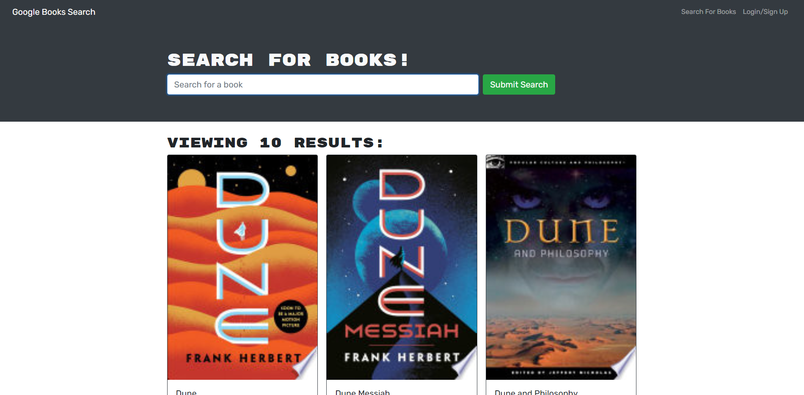

# Book Search 

## Description

This website allows users to login and search for books while saving them to their account.

## Contents
- [Installation](#installation)
- [Usage](#usage)
- [License](#license)
- [Contact](#contact)

## Installation
Clone the repository and run "npm i" while in the root of the directory.

## Usage
To start a local server, run "npm run develop".

## License
The project uses the [Do WTF You Want To](http://www.wtfpl.net/) license.

## Contact
Link to my github: [sagegrayson](https://github.com/sagegrayson)

If you'd like to contact me, email me at [skaseyg@gmail.com](mailto:skaseyg@gmail.com)
